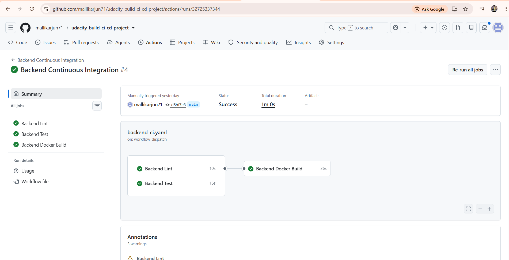
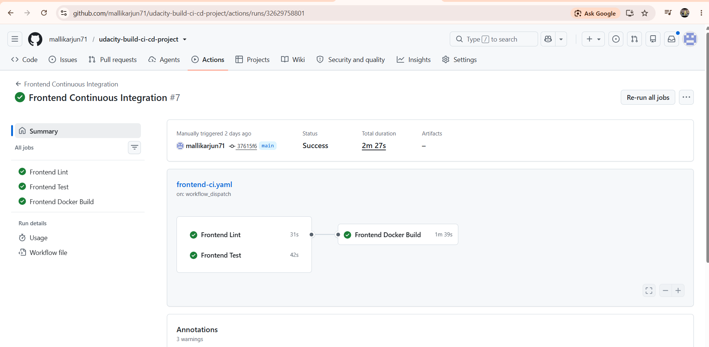
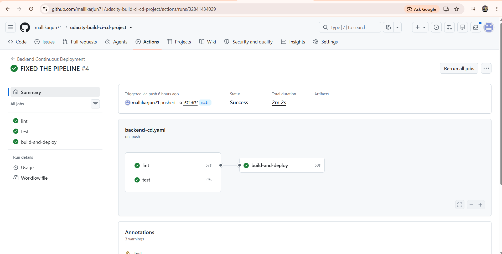
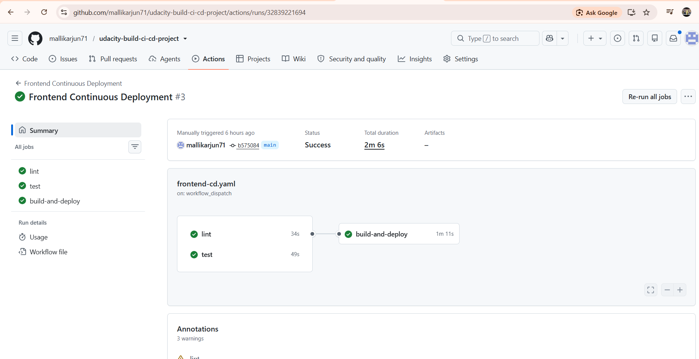
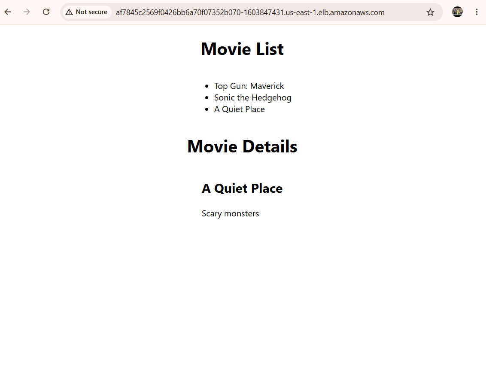
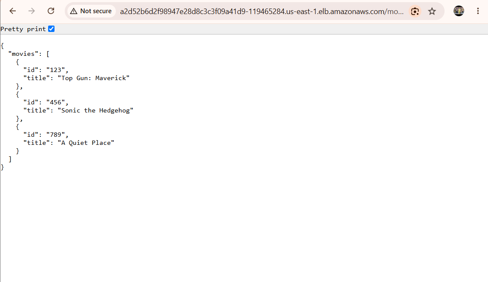

# Submission Evidence

## GitHub Repository
https://github.com/mallikarjun71/udacity-build-ci-cd-project

## Live Application URLs
- **Frontend:** http://af7845c2569f0426bb6a70f07352b070-1603847431.us-east-1.elb.amazonaws.com
- **Backend `/movies`:** http://a2d52b6d2f98947e28d8c3c3f09a41d9-119465284.us-east-1.elb.amazonaws.com/movies

## GitHub Actions — Successful Runs

### Backend Continuous Integration

### Frontend Continuous Integration

### Backend Continuous Deployment

### Frontend Continuous Deployment

## Live Application Screenshots

### Frontend — Movie List (ELB URL in address bar)

### Backend — /movies Endpoint (ELB URL in address bar)

